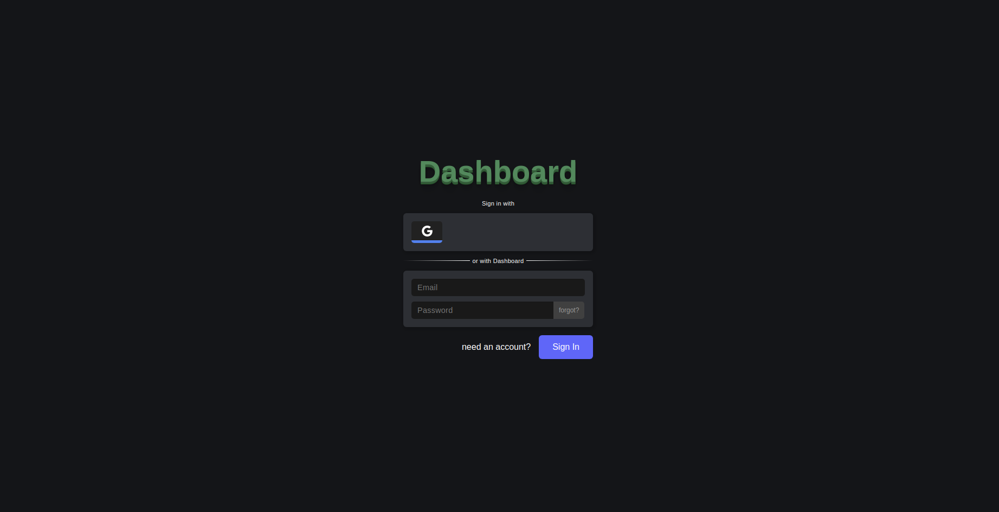
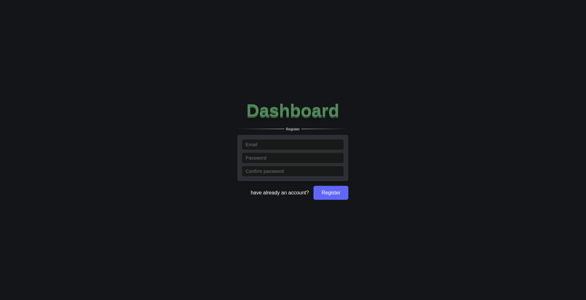
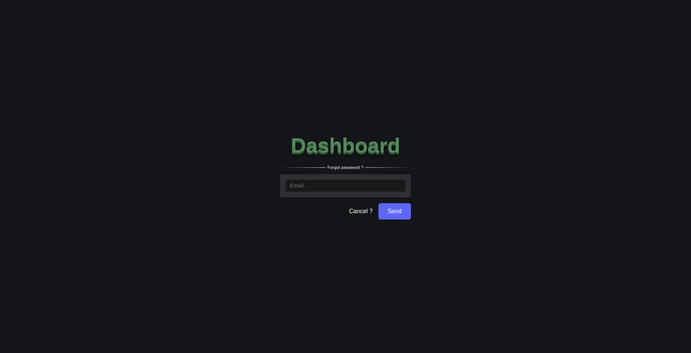
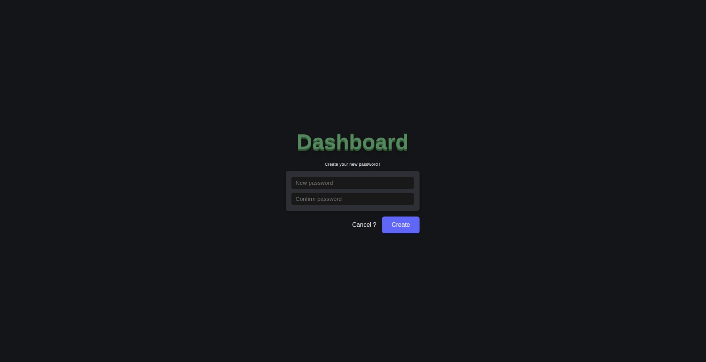
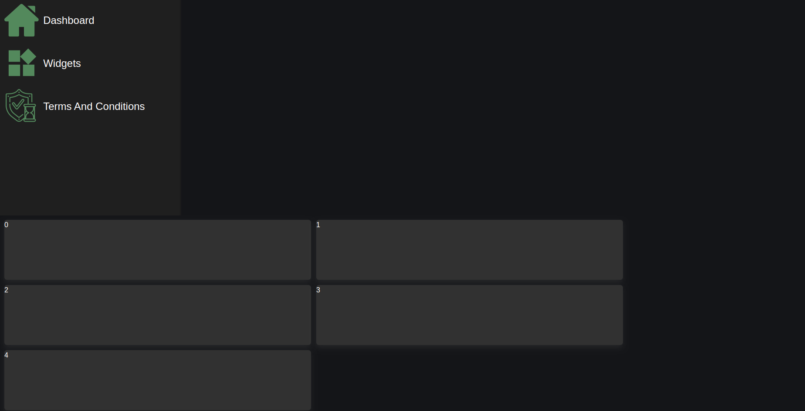
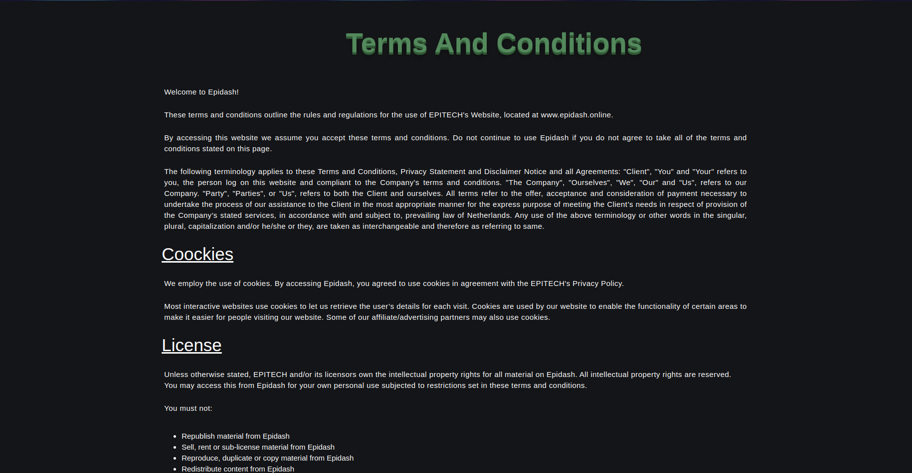

# Epidash

## About us

Authors of the project:
* Auguste ALEXANDRE
* Eliot LE-GALL

We are, both of us, 3rd year students in EPITECH Paris.

## Description

The objective of this project is to create a dashboard which handle different widgets, it's named Epidash.

## Usage

### Install

* docker
* docker-compose

### Launch the project

```
$ docker-compose up --build
```

## Notice

### How to use Epidash ?

Before using your dashboard, you need an account. If you have one, you can connect otherwise you have to create one or connect with google.<br />
See below:

<p align="center">
  
</p></br></br>

By clicking on the "need an account" button, you will be able to create an account.<br />
After clicking on the "register" button, you will receive an e-mail with a validation link.<br />You have to click on to get your account valid !<br />
See below:

<p align="center">
  
</p></br></br>

If you have lost your account (ex: missing password), you can click on the "forgot" button to get a new password.<br />
You'll have to write your e-mail address and a mail will be sent to you.<br />
This e-mail contain a link and you'll be able to get a new password.

<p align="center">
  
</p></br></br>

<p align="center">
  and
</p></br></br>

<p align="center">
  
</p>

If you logged in, you'll see your home page.

<p align="center">
  
</p></br></br>

By clicking on the "Terms And Conditions" button, you'll able to read the Terms and Conditions of Epidash.

<p align="center">
  
</p></br></br>

by clicking on the "Widgets" button, you'll be able to add a specific widget to your dashboard.<br />
See below:
